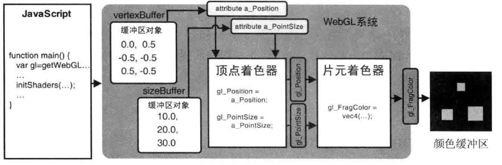

# 颜色和纹理

1. 将顶点的其他（非坐标）数据 ————颜色等————传入顶点着色器
2. 发生在顶点着色器和片元着色器之间的从图形到片元的转化，又称为**图元光栅化**
3. 将图像（或纹理）映射到图形或三维对象的表面上

## 将非坐标数据传入顶点着色器

```js
const VSHADER_SOURCE =
    'attribute vec4 a_Position;\n' +
    'attribute float a_PointSize;\n' +
    'void main() {\n' +
    'gl_Position = a_Position;\n' +
    'gl_PointSize = a_PointSize;\n' +
    '}\n'
const FSHADER_SOURCE =
    ' void main() {\n' +
    'gl_FragColor = vec4(1.0, 1.0, 0.0,1.0);\n' +
    '}\n'

function main() {
    var canvas = document.getElementById('webgl')
    var gl = getWebGLContext(canvas)
    if (!gl) {
        console.error('Failed to get the rendering context for WebGL')
        return;
    }

    // 初始化着色器
    if (!initShaders(gl, VSHADER_SOURCE, FSHADER_SOURCE)) {
        console.error('Failed to initialize shaders.')
        return;
    }

    // 设置顶点着色器
    var n = initVertexBuffers(gl);

    if (n < 0) {
        console.error('Failed to set the positions of the vertices')
        return;
    }

    // 获取attribut变量的存储位置
    var a_Position = gl.getAttribLocation(gl.program, 'a_Position')


    if (a_Position < 0) {
        console.error('Failed to get the storage location of a_Position')
        return;
    }

    // 设置canvas背景色
    gl.clearColor(0.0, 0.0, 0.0, 1.0)

    // 清空canvas
    gl.clear(gl.COLOR_BUFFER_BIT);

    // 绘制三个点
    gl.drawArrays(gl.POINTS, 0, n)

}


function initVertexBuffers(gl) {
    var vertices = new Float32Array([
        0.0, 0.5, -0.5,-0.5, 0.5,-0.5
    ])
    var n =3 // 点的个数

    var sizes = new Float32Array([
        10.0, 20.0, 30.0
    ])
    // 创建缓冲区对象
    var vertexBuffer = gl.createBuffer();
    var sizeBuffer = gl.createBuffer();
    if (!vertexBuffer) {
        console.error('Failed to create the buffer object')
        return -1;
    }

    // 将缓冲区对象绑定到目标
    gl.bindBuffer(gl.ARRAY_BUFFER, vertexBuffer)


    // 向缓冲区对象中写入数据
    gl.bufferData(gl.ARRAY_BUFFER, vertices, gl.STATIC_DRAW);


    var a_Position = gl.getAttribLocation(gl.program, 'a_Position');


    // 将缓冲区对象分配给a_Position变量
    gl.vertexAttribPointer(a_Position, 2, gl.FLOAT, false, 0, 0)


    // 连接a_Position变量与分配给它的缓冲对象
    gl.enableVertexAttribArray(a_Position)

    gl.bindBuffer(gl.ARRAY_BUFFER, sizeBuffer)
    gl.bufferData(gl.ARRAY_BUFFER, sizes, gl.STATIC_DRAW);
    var a_PointSize = gl.getAttribLocation(gl.program, 'a_PointSize')
    gl.vertexAttribPointer(a_PointSize, 1, gl.FLOAT, false, 0, 0)
    gl.enableVertexAttribArray(a_PointSize)
    return n
}

```
效果图


原理图


### gl.vertexAttribPointer() 的步进和偏移参数

> 使用多个缓冲区对象向着色器传递多种数据,比较适合数据量不大的情况. 当程序中的复杂三维图形具有成千上万个顶点时,维护所有顶点的数据很困难.
> WebGL允许我们把顶点的坐标和尺寸数据打包到同一个缓冲区对象中,并通过某种机制分别访问向缓冲区对象中不同种类的数据.
> 可以将顶点的坐标和尺寸数据按照如下方式交错组织

```js
var verticesSizes = new Float32Array([
    0.0, 0.5, 10.0,
    -0.5, -0.5, 20.0,
    0.5, -0.5, 30.0
])
```

如上,我们将集中 逐顶点 的数据(坐标和尺寸)交叉存储在一个数组中,并将数组写入一个缓冲区对象. WebGL就需要有差别地冲缓冲区中获取某种特定数据(坐标或尺寸),
即使用`gl.vertexAttribPointer()`函数的第5个参数`stride`和第6个参数`offset`.

```js
const VSHADER_SOURCE =
    'attribute vec4 a_Position;\n' +
    'attribute float a_PointSize;\n' +
    'void main() {\n' +
    'gl_Position = a_Position;\n' +
    'gl_PointSize = a_PointSize;\n' +
    '}\n'
const FSHADER_SOURCE =
    ' void main() {\n' +
    'gl_FragColor = vec4(1.0, 1.0, 0.0,1.0);\n' +
    '}\n'

function main() {
    var canvas = document.getElementById('webgl')
    var gl = getWebGLContext(canvas)
    if (!gl) {
        console.error('Failed to get the rendering context for WebGL')
        return;
    }

    // 初始化着色器
    if (!initShaders(gl, VSHADER_SOURCE, FSHADER_SOURCE)) {
        console.error('Failed to initialize shaders.')
        return;
    }

    // 设置顶点着色器
    var n = initVertexBuffers(gl);

    if (n < 0) {
        console.error('Failed to set the positions of the vertices')
        return;
    }

    // 获取attribut变量的存储位置
    var a_Position = gl.getAttribLocation(gl.program, 'a_Position')


    if (a_Position < 0) {
        console.error('Failed to get the storage location of a_Position')
        return;
    }

    // 设置canvas背景色
    gl.clearColor(0.0, 0.0, 0.0, 1.0)

    // 清空canvas
    gl.clear(gl.COLOR_BUFFER_BIT);

    // 绘制三个点
    gl.drawArrays(gl.POINTS, 0, n)

}


function initVertexBuffers(gl) {
    var vertices = new Float32Array([ // [!code --]
        0.0, 0.5, -0.5,-0.5, 0.5,-0.5 // [!code --]
    ]) // [!code --]
    var verticesSizes = new Float32Array([ // [!code ++]
        0.0, 0.5,10.0, -0.5,-0.5,20.0, 0.5,-0.5,30.0 // [!code ++]
    ]) // [!code ++]
    var n =3 // 点的个数
    var sizes = new Float32Array([ // [!code --]
        10.0, 20.0, 30.0 // [!code --]
    ]) // [!code --]
    // 创建缓冲区对象
    var vertexBuffer = gl.createBuffer();// [!code --]
    var sizeBuffer = gl.createBuffer(); // [!code --]
    var vertexSizeBuffer = gl.createBuffer(); // [!code ++]
    if (!vertexSizeBuffer) {
        console.error('Failed to create the buffer object')
        return -1;
    }

    // 将缓冲区对象绑定到目标
    gl.bindBuffer(gl.ARRAY_BUFFER, vertexBuffer) // [!code --]
    gl.bindBuffer(gl.ARRAY_BUFFER, vertexSizeBuffer) // [!code ++]
    

    // 向缓冲区对象中写入数据
    gl.bufferData(gl.ARRAY_BUFFER, vertices, gl.STATIC_DRAW); // [!code --]
    gl.bufferData(gl.ARRAY_BUFFER, verticesSizes, gl.STATIC_DRAW); // [!code ++]

    var FSIZE = verticesSizes.BYTES_PER_ELEMENT  //数组中每个元素所占的字节数 // [!code ++]

    var a_Position = gl.getAttribLocation(gl.program, 'a_Position');


    // 将缓冲区对象分配给a_Position变量
    gl.vertexAttribPointer(a_Position, 2, gl.FLOAT, false, 0, 0) // [!code --]
    gl.vertexAttribPointer(a_Position, 2, gl.FLOAT, false, FSIZE * 3, 0)  // FSIZE * 3 即指定相邻两个顶点间的字节数，默认为0 // [!code ++]


    // 连接a_Position变量与分配给它的缓冲对象
    gl.enableVertexAttribArray(a_Position) // 开启分配


    var a_PointSize = gl.getAttribLocation(gl.program, 'a_PointSize'); // [!code ++]

    gl.vertexAttribPointer(a_PointSize, 1, gl.FLOAT, false, FSIZE * 3,  FSIZE * 2) // [!code ++]
    gl.bindBuffer(gl.ARRAY_BUFFER, sizeBuffer)  // [!code --]
    gl.bufferData(gl.ARRAY_BUFFER, sizes, gl.STATIC_DRAW); // [!code --]
    var a_PointSize = gl.getAttribLocation(gl.program, 'a_PointSize') // [!code --]
    gl.vertexAttribPointer(a_PointSize, 1, gl.FLOAT, false, 0, 0) // [!code --]
    gl.enableVertexAttribArray(a_PointSize) 
    return n
}

```


### 修改颜色 (varying 变量)


