# 颜色和纹理

1. 将顶点的其他（非坐标）数据 ————颜色等————传入顶点着色器
2. 发生在顶点着色器和片元着色器之间的从图形到片元的转化，又称为**图元光栅化**
3. 将图像（或纹理）映射到图形或三维对象的表面上

## 将非坐标数据传入顶点着色器

```js
const VSHADER_SOURCE =
    'attribute vec4 a_Position;\n' +
    'attribute float a_PointSize;\n' +
    'void main() {\n' +
    'gl_Position = a_Position;\n' +
    'gl_PointSize = a_PointSize;\n' +
    '}\n'
const FSHADER_SOURCE =
    ' void main() {\n' +
    'gl_FragColor = vec4(1.0, 1.0, 0.0,1.0);\n' +
    '}\n'

function main() {
    var canvas = document.getElementById('webgl')
    var gl = getWebGLContext(canvas)
    if (!gl) {
        console.error('Failed to get the rendering context for WebGL')
        return;
    }

    // 初始化着色器
    if (!initShaders(gl, VSHADER_SOURCE, FSHADER_SOURCE)) {
        console.error('Failed to initialize shaders.')
        return;
    }

    // 设置顶点着色器
    var n = initVertexBuffers(gl);

    if (n < 0) {
        console.error('Failed to set the positions of the vertices')
        return;
    }

    // 获取attribut变量的存储位置
    var a_Position = gl.getAttribLocation(gl.program, 'a_Position')


    if (a_Position < 0) {
        console.error('Failed to get the storage location of a_Position')
        return;
    }

    // 设置canvas背景色
    gl.clearColor(0.0, 0.0, 0.0, 1.0)

    // 清空canvas
    gl.clear(gl.COLOR_BUFFER_BIT);

    // 绘制三个点
    gl.drawArrays(gl.POINTS, 0, n)

}


function initVertexBuffers(gl) {
    var vertices = new Float32Array([
        0.0, 0.5, -0.5,-0.5, 0.5,-0.5
    ])
    var n =3 // 点的个数

    var sizes = new Float32Array([
        10.0, 20.0, 30.0
    ])
    // 创建缓冲区对象
    var vertexBuffer = gl.createBuffer();
    var sizeBuffer = gl.createBuffer();
    if (!vertexBuffer) {
        console.error('Failed to create the buffer object')
        return -1;
    }

    // 将缓冲区对象绑定到目标
    gl.bindBuffer(gl.ARRAY_BUFFER, vertexBuffer)


    // 向缓冲区对象中写入数据
    gl.bufferData(gl.ARRAY_BUFFER, vertices, gl.STATIC_DRAW);


    var a_Position = gl.getAttribLocation(gl.program, 'a_Position');


    // 将缓冲区对象分配给a_Position变量
    gl.vertexAttribPointer(a_Position, 2, gl.FLOAT, false, 0, 0)


    // 连接a_Position变量与分配给它的缓冲对象
    gl.enableVertexAttribArray(a_Position)

    gl.bindBuffer(gl.ARRAY_BUFFER, sizeBuffer)
    gl.bufferData(gl.ARRAY_BUFFER, sizes, gl.STATIC_DRAW);
    var a_PointSize = gl.getAttribLocation(gl.program, 'a_PointSize')
    gl.vertexAttribPointer(a_PointSize, 1, gl.FLOAT, false, 0, 0)
    gl.enableVertexAttribArray(a_PointSize)
    return n
}

```
效果图
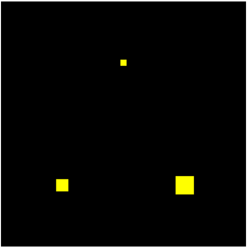

原理图
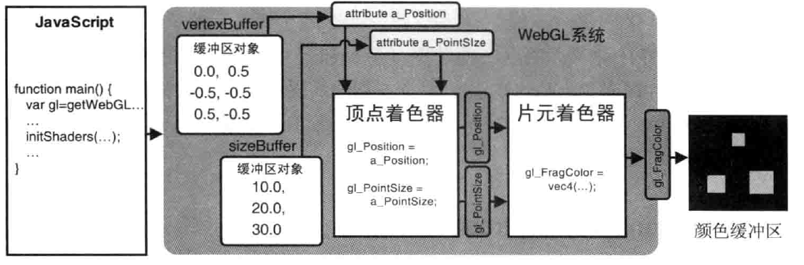

### gl.vertexAttribPointer() 的步进和偏移参数

> 使用多个缓冲区对象向着色器传递多种数据,比较适合数据量不大的情况. 当程序中的复杂三维图形具有成千上万个顶点时,维护所有顶点的数据很困难.
> WebGL允许我们把顶点的坐标和尺寸数据打包到同一个缓冲区对象中,并通过某种机制分别访问向缓冲区对象中不同种类的数据.
> 可以将顶点的坐标和尺寸数据按照如下方式交错组织

```js
var verticesSizes = new Float32Array([
    0.0, 0.5, 10.0,
    -0.5, -0.5, 20.0,
    0.5, -0.5, 30.0
])
```

如上,我们将集中 逐顶点 的数据(坐标和尺寸)交叉存储在一个数组中,并将数组写入一个缓冲区对象. WebGL就需要有差别地冲缓冲区中获取某种特定数据(坐标或尺寸),
即使用`gl.vertexAttribPointer()`函数的第5个参数`stride`和第6个参数`offset`.

```js
const VSHADER_SOURCE =
    'attribute vec4 a_Position;\n' +
    'attribute float a_PointSize;\n' +
    'void main() {\n' +
    'gl_Position = a_Position;\n' +
    'gl_PointSize = a_PointSize;\n' +
    '}\n'
const FSHADER_SOURCE =
    ' void main() {\n' +
    'gl_FragColor = vec4(1.0, 1.0, 0.0,1.0);\n' +
    '}\n'

function main() {
    var canvas = document.getElementById('webgl')
    var gl = getWebGLContext(canvas)
    if (!gl) {
        console.error('Failed to get the rendering context for WebGL')
        return;
    }

    // 初始化着色器
    if (!initShaders(gl, VSHADER_SOURCE, FSHADER_SOURCE)) {
        console.error('Failed to initialize shaders.')
        return;
    }

    // 设置顶点着色器
    var n = initVertexBuffers(gl);

    if (n < 0) {
        console.error('Failed to set the positions of the vertices')
        return;
    }

    // 获取attribut变量的存储位置
    var a_Position = gl.getAttribLocation(gl.program, 'a_Position')


    if (a_Position < 0) {
        console.error('Failed to get the storage location of a_Position')
        return;
    }

    // 设置canvas背景色
    gl.clearColor(0.0, 0.0, 0.0, 1.0)

    // 清空canvas
    gl.clear(gl.COLOR_BUFFER_BIT);

    // 绘制三个点
    gl.drawArrays(gl.POINTS, 0, n)

}


function initVertexBuffers(gl) {
    var vertices = new Float32Array([ // [!code --]
        0.0, 0.5, -0.5,-0.5, 0.5,-0.5 // [!code --]
    ]) // [!code --]
    var verticesSizes = new Float32Array([ // [!code ++]
        0.0, 0.5,10.0, -0.5,-0.5,20.0, 0.5,-0.5,30.0 // [!code ++]
    ]) // [!code ++]
    var n =3 // 点的个数
    var sizes = new Float32Array([ // [!code --]
        10.0, 20.0, 30.0 // [!code --]
    ]) // [!code --]
    // 创建缓冲区对象
    var vertexBuffer = gl.createBuffer();// [!code --]
    var sizeBuffer = gl.createBuffer(); // [!code --]
    var vertexSizeBuffer = gl.createBuffer(); // [!code ++]
    if (!vertexSizeBuffer) {
        console.error('Failed to create the buffer object')
        return -1;
    }

    // 将缓冲区对象绑定到目标
    gl.bindBuffer(gl.ARRAY_BUFFER, vertexBuffer) // [!code --]
    gl.bindBuffer(gl.ARRAY_BUFFER, vertexSizeBuffer) // [!code ++]
    

    // 向缓冲区对象中写入数据
    gl.bufferData(gl.ARRAY_BUFFER, vertices, gl.STATIC_DRAW); // [!code --]
    gl.bufferData(gl.ARRAY_BUFFER, verticesSizes, gl.STATIC_DRAW); // [!code ++]

    var FSIZE = verticesSizes.BYTES_PER_ELEMENT  //数组中每个元素所占的字节数 // [!code ++]

    var a_Position = gl.getAttribLocation(gl.program, 'a_Position');


    // 将缓冲区对象分配给a_Position变量
    gl.vertexAttribPointer(a_Position, 2, gl.FLOAT, false, 0, 0) // [!code --]
    gl.vertexAttribPointer(a_Position, 2, gl.FLOAT, false, FSIZE * 3, 0)  // FSIZE * 3 即指定相邻两个顶点间的字节数，默认为0 // [!code ++]


    // 连接a_Position变量与分配给它的缓冲对象
    gl.enableVertexAttribArray(a_Position) // 开启分配


    var a_PointSize = gl.getAttribLocation(gl.program, 'a_PointSize'); // [!code ++]

    gl.vertexAttribPointer(a_PointSize, 1, gl.FLOAT, false, FSIZE * 3,  FSIZE * 2) // [!code ++]
    gl.bindBuffer(gl.ARRAY_BUFFER, sizeBuffer)  // [!code --]
    gl.bufferData(gl.ARRAY_BUFFER, sizes, gl.STATIC_DRAW); // [!code --]
    var a_PointSize = gl.getAttribLocation(gl.program, 'a_PointSize') // [!code --]
    gl.vertexAttribPointer(a_PointSize, 1, gl.FLOAT, false, 0, 0) // [!code --]
    gl.enableVertexAttribArray(a_PointSize) 
    return n
}

```


### 修改颜色 (varying 变量)

片元着色器可以用来处理颜色之类的属性。 但是到目前为止，我们都只是在片元着色器中静态地设置颜色，还没有真正研究过片元着色器。虽然现在已经能够将顶点的颜色数据从 javascript 中传递给顶点着色器中的attribute变量，
但是真正能够影响绘制颜色的gl_FragColor 却在片元着色器中。我们需要知道顶点着色器和片元着色器是如何交流的=，这样才能使传入顶点着色器的数据进入片元着色器。

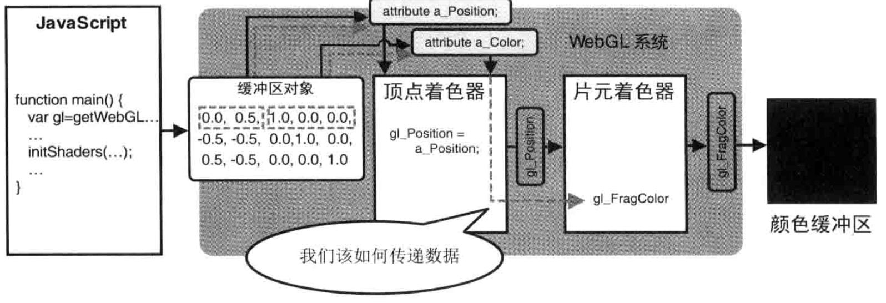

使用`uniform`变量,没法为每个顶点都准备一个值。 使用`varying`变量向片元着色器中传入数据，**varying变量的作用是从顶点着色器向片元着色器传输数据**

```js
const VSHADER_SOURCE =
    'attribute vec4 a_Position;\n' +
    'attribute vec4 a_Color;\n' + // [!code ++]
    'varying vec4 v_Color;\n' + // [!code ++]
    'void main() {\n' +
    'gl_Position = a_Position;\n' +
    'gl_PointSize = 10.0;\n' +
    'v_Color = a_Color;\n' +  // 将数据传给片元着色器 // [!code ++]
    '}\n';
const FSHADER_SOURCE =
    '#ifdef GL_ES\n' + // [!code ++]
    'precision mediump float;\n' + //精度限定，中精度 // [!code ++]
    '#endif\n' + // [!code ++]
    'varying vec4 v_Color;\n' + // [!code ++]
    ' void main() {\n' +
    'gl_FragColor = v_Color;\n' + // 从顶点着色器接收数据 // [!code ++]
    'gl_FragColor = vec4(1.0, 1.0, 0.0,1.0);\n' + // [!code --]
    '}\n'

function main() {
    var canvas = document.getElementById('webgl')
    var gl = getWebGLContext(canvas)
    if (!gl) {
        console.error('Failed to get the rendering context for WebGL')
        return;
    }

    // 初始化着色器
    if (!initShaders(gl, VSHADER_SOURCE, FSHADER_SOURCE)) {
        console.error('Failed to initialize shaders.')
        return;
    }

    // 设置顶点着色器
    var n = initVertexBuffers(gl);

    if (n < 0) {
        console.error('Failed to set the positions of the vertices')
        return;
    }

    // 获取attribut变量的存储位置
    var a_Position = gl.getAttribLocation(gl.program, 'a_Position')


    if (a_Position < 0) {
        console.error('Failed to get the storage location of a_Position')
        return;
    }

    // 设置canvas背景色
    gl.clearColor(0.0, 0.0, 0.0, 1.0)

    // 清空canvas
    gl.clear(gl.COLOR_BUFFER_BIT);

    // 绘制三个点
    gl.drawArrays(gl.POINTS, 0, n)

}


function initVertexBuffers(gl) {
    var verticesSizes = new Float32Array([ // [!code --]
        0.0, 0.5,10.0, -0.5,-0.5,20.0, 0.5,-0.5,30.0 // [!code --]
    ]) // [!code --]

    var verticesColors = new Float32Array([  // [!code ++]
        // 顶点坐标和颜色 // [!code ++]
        0.0, 0.5, 1.0, 0.0, 0.0, // [!code ++]
        -0.5, -0.5, 0.0, 1.0, 0.0, // [!code ++]
        0.5, -0.5, 0.0, 0.0, 1.0 // [!code ++]
    ]) // [!code ++]

    var n =3 // 点的个数

    // 创建缓冲区对象
    var vertexSizeBuffer = gl.createBuffer(); // [!code --]

    var vertexColorBuffer = gl.createBuffer(); // [!code ++]
    if (!vertexColorBuffer) {
        console.error('Failed to create the buffer object')
        return -1;
    }

    // 将缓冲区对象绑定到目标
    gl.bindBuffer(gl.ARRAY_BUFFER, vertexColorBuffer)

    // 向缓冲区对象中写入数据
    gl.bufferData(gl.ARRAY_BUFFER, verticesColors, gl.STATIC_DRAW)

    var FSIZE = verticesColors.BYTES_PER_ELEMENT  //数组中每个元素所占的字节数

    var a_Position = gl.getAttribLocation(gl.program, 'a_Position');


    // 将缓冲区对象分配给a_Position变量
    gl.vertexAttribPointer(a_Position, 2, gl.FLOAT, false, FSIZE * 5, 0)

    // 连接a_Position变量与分配给它的缓冲对象
    gl.enableVertexAttribArray(a_Position) // 开启分配


    var a_Color = gl.getAttribLocation(gl.program, 'a_Color');
    gl.vertexAttribPointer(a_Color, 3, gl.FLOAT, false, FSIZE * 5, FSIZE * 2)

    gl.enableVertexAttribArray(a_Color)


    return n
}

```

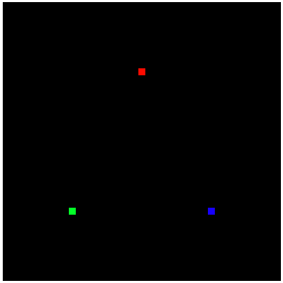

**下面者三句 必须要 至于为什么要这个精度限定，还没找到答案， 但是没有这三局，初始化着色器会失败（这个问题找了半天）**
```js
'#ifdef GL_ES\n' +
'precision mediump float;\n' + //精度限定，中精度
'#endif\n' 
```

修改参数为`gl.TRIANGLES` 

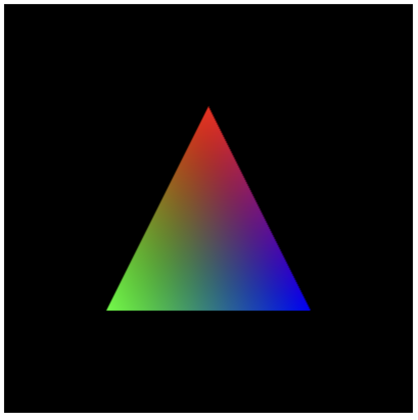


## 彩色三角形

### 几何形状的装配和光栅化

顶点坐标、图形装配、光栅化、执行片元着色器

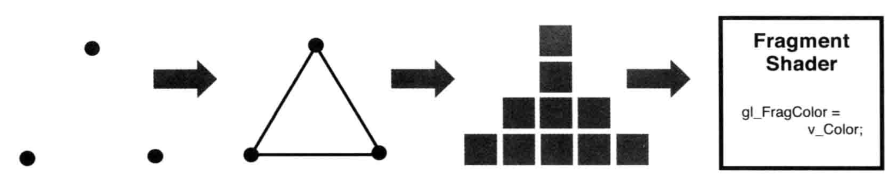

- 图形装配过程： 这一步的任务是，将孤立的顶点坐标装配成几何图形。几何图形的类别由`gl.drawArrays()`函数的第一个参数决定
- 光栅化过程：这一步的任务是，将装配好的几何图形转化为片元

顶点着色器和片元着色器之间的图形装配和光栅化
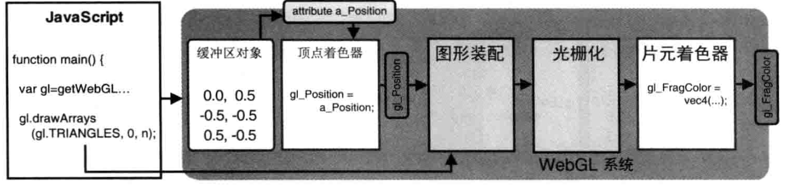

`gl_Position`实际上是**几何图形装配**阶段的输入数据。几何图形的装配过程又被称为**图元装配过程**，因为被装配出的基本图形（点、线、面）又被称为**图元**

### 调用片元着色器

一旦光栅化过程结束后，程序就开始逐片元调用片元着色器。每调用一个片元，就处理一个片元。对于每个片元，片元着色器计算出该片元的颜色，并写入颜色缓冲区。

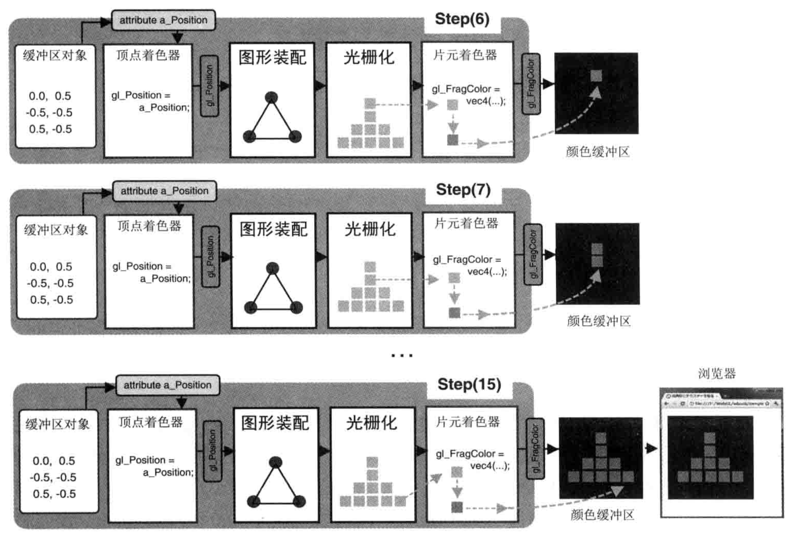


光栅化过程生成的片元都是带有坐标信息的，调用片元着色器时，这些坐标信息页随着片元传了进去，可以通过**片元着色器中的内置变量**来访问片元坐标

| 类型和变量名            | 描述                                             |
|-------------------|------------------------------------------------|
| vec4 gl_FragCoord | 该内置的变量的第一个和第二个分量表示片元在<canvas>坐标系统（窗口坐标系统）中的坐标值 |


```js
const VSHADER_SOURCE =
    'attribute vec4 a_Position;\n' +
    'void main() {\n' +
    'gl_PointSize = 10.0;\n' +
    'gl_Position = a_Position;\n' +
    '}\n'
const FSHADER_SOURCE =
    'void main() {\n' +
    'gl_FragColor = vec4(1.0, 0.0, 0.0, 1.0);\n' +
    '}\n'

function main() {
    const canvas = document.getElementById('webgl')

    const gl = getWebGLContext(canvas)

    if(!gl) {
        console.error('Failed to get the rendering context for WebGL')
        return;
    }

    if(!initShaders(gl,VSHADER_SOURCE, FSHADER_SOURCE )) {
        console.error('Failed to  initialize shaders.')
    }

    const n = initVertexBuffers(gl)
    console.log(n)
    if(n < 0) {
        console.error('Failed to set the positions of the vertices')
    }


    gl.clearColor(0.0, 0.0, 0.0, 1.0)

    gl.clear(gl.COLOR_BUFFER_BIT)

    gl.drawArrays(gl.TRIANGLES, 0, n)
}

function initVertexBuffers(gl) {
    const vertices = new Float32Array([
        0.0, 0.5, -0.5, -0.5, 0.5, -0.5
    ])
    let n = 3

    const vertexBuffer = gl.createBuffer()

    if(!vertexBuffer) {
        console.error('Failed to create the buffer object')
        return -1;
    }

    gl.bindBuffer(gl.ARRAY_BUFFER, vertexBuffer)

    gl.bufferData(gl.ARRAY_BUFFER, vertices, gl.STATIC_DRAW)

    const a_Position = gl.getAttribLocation(gl.program, 'a_Position')

    gl.vertexAttribPointer(a_Position, 2, gl.FLOAT, false, 0, 0)

    gl.enableVertexAttribArray(a_Position)

    return n
}

```

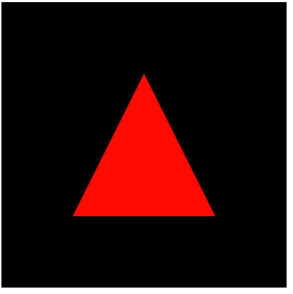


为了证明片元着色器是逐片执行的，将代码修改

```js
const VSHADER_SOURCE =
    'attribute vec4 a_Position;\n' +
    'void main() {\n' +
    'gl_PointSize = 10.0;\n' +
    'gl_Position = a_Position;\n' +
    '}\n'
const FSHADER_SOURCE =
    'void main() {\n' + // ![code --]
    'gl_FragColor = vec4(1.0, 0.0, 0.0, 1.0);\n' + // ![code --]
    '}\n' // ![code --]
    'precision mediump float;\n'+ // [!code ++]
    'uniform float u_Width;\n'+ // [!code ++]
    'uniform float u_Height;\n' + // [!code ++]
    'void main(){' + // [!code ++]
    'gl_FragColor = vec4(gl_FragCoord.x/u_Width, 0.0, gl_FragCoord.y/u_Height, 1.0);\n' + // [!code ++]
    '}' // [!code ++]


function main() {
    const canvas = document.getElementById('webgl')

    const gl = getWebGLContext(canvas)

    if(!gl) {
        console.error('Failed to get the rendering context for WebGL')
        return;
    }

    if(!initShaders(gl,VSHADER_SOURCE, FSHADER_SOURCE )) {
        console.error('Failed to  initialize shaders.')
    }

    const n = initVertexBuffers(gl)
    console.log(n)
    if(n < 0) {
        console.error('Failed to set the positions of the vertices')
    }


    gl.clearColor(0.0, 0.0, 0.0, 1.0)

    gl.clear(gl.COLOR_BUFFER_BIT)

    gl.drawArrays(gl.TRIANGLES, 0, n)
}

function initVertexBuffers(gl) {
    const vertices = new Float32Array([
        0.0, 0.5, -0.5, -0.5, 0.5, -0.5
    ])
    let n = 3

    const vertexBuffer = gl.createBuffer()

    if(!vertexBuffer) {
        console.error('Failed to create the buffer object')
        return -1;
    }

    gl.bindBuffer(gl.ARRAY_BUFFER, vertexBuffer)

    gl.bufferData(gl.ARRAY_BUFFER, vertices, gl.STATIC_DRAW)

    const a_Position = gl.getAttribLocation(gl.program, 'a_Position')

    gl.vertexAttribPointer(a_Position, 2, gl.FLOAT, false, 0, 0)

    gl.enableVertexAttribArray(a_Position)

    const u_Width = gl.getUniformLocation(gl.program, 'u_Width') // [!code ++]
    const u_Height = gl.getUniformLocation(gl.program, 'u_Height') // [!code ++]

    // 赋值
    gl.uniform1f(u_Width, gl.drawingBufferWidth) // [!code ++]
    // WebGL中的颜色分量值区间为0.0到1.0， 且canvas中的Y轴方向和WebGL系统中的Y轴方向是相反的
    gl.uniform1f(u_Height, gl.drawingBufferHeight/400) // [!code ++]
    return n
}
```

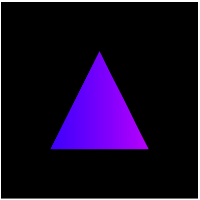


### varying 变量的作用和内插过程

了解了顶点着色器与片元着色器之间的几何图形装配和光栅化过程，明白了系统是怎么样逐片执行片元着色器的了

在顶点着色器中只指定了每个顶点的颜色，最后得到一个具有渐变色彩的效果的三角形，事实上，我们把顶点的颜色赋值给了顶点着色器中的varying变量v_color，
它的值被传给了片元着色器中的同名、同类型的变量（即片元着色器中的varying变量v_Color),但是更准确的说，顶点着色器中的v_Color变量和顶点着色器中的
v_Color变量实际上不是一回事，这也正是我们将这种变量称为 “varying”（变化的）变量的原因

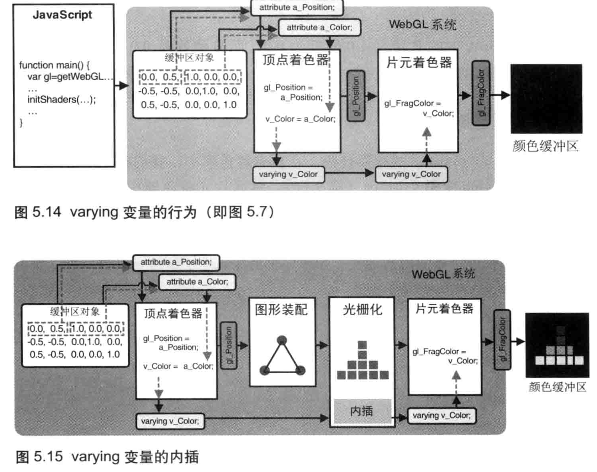


## 在矩形表面贴上图像


**纹理映射**，将一张真实世界的图片贴到一个由两个三角形组成的矩形上，这样矩形表面看上去就是这张图片。此时，这张图片可以称为**纹理图像**或**纹理**

**纹理映射的作用**，就是根据纹理图像，为之前光栅化后的每个片元涂上合适的颜色。组成纹理图像的像素又被称为**纹素**，每个纹素的颜色都使用RGB或RGBA格式编码


在WebGL中，要进行纹理映射，需要遵循以下四步：

1. 准备好映射到几何图形上的纹理图像
2. 为几何图形配置纹理映射方式
3. 加载纹理图像，对其进行一些配置，在WebGL中使用它
4. 在片元着色器中将相应的纹素从纹理中抽区出来，并将纹素的颜色赋给片元

使用**纹理坐标**来确定纹理图像的哪个部分将覆盖到几何图形上。纹理坐标是一套新的坐标系统。

### 纹理坐标

通过纹理坐标可以在纹理图像上获取纹素颜色。WebGL系统中的纹理坐标系统是二维的。为了将纹理坐标和广泛使用的x坐标和y坐标区分开来，WebGL使用s和t命名纹理坐标（st坐标系统）


**将纹理图像粘贴到几何图形上**

```js
const VSHADER_SOURCE =
    'attribute vec4 a_Position;\n' +
    'attribute vec2 a_TexCoord;\n' +
    'varying vec2 v_TexCoord;\n' +
    'void main() {\n' +
    'v_TexCoord = a_TexCoord;\n' +
    'gl_Position = a_Position;\n' +
    // 'gl.PositSize = 30.0;\n' +
    '}\n';
const FSHADER_SOURCE =
    'precision mediump float;\n'+
    // 'uniform float u_Width;\n'+
    // 'uniform float u_Height;\n' +
    'uniform sampler2D u_Sampler;\n' +
    'varying vec2 v_TexCoord;\n' +
    'void main(){' +
    'gl_FragColor = texture2D(u_Sampler, v_TexCoord);\n' +
    '}';

// import textture from '../images/textture.jpeg'/

function main() {
    const canvas = document.getElementById('webgl')

    const gl = getWebGLContext(canvas)

    if(!gl) {
        console.error('Failed to get the rendering context for WebGL')
        return;
    }

    if(!initShaders(gl,VSHADER_SOURCE, FSHADER_SOURCE )) {
        console.error('Failed to  initialize shaders.')
    }

    const n = initVertexBuffers(gl)
    if(n < 0) {
        console.error('Failed to set the positions of the vertices')
    }

    if(!initTextures(gl,n)) {
        console.error('Failed to initialize Texture')
    }


}

function initVertexBuffers(gl) {
    const verticesTexCoords = new Float32Array([
        // 顶点坐标  纹理坐标
        -0.5, 0.5, 0.0, 1.0,
        -0.5, -0.5, 0.0, 0.0,
        0.5, 0.5, 1.0, 1.0,
        0.5, -0.5, 1.0, 0.0
    ])
    let n = 4

    const vertexTexCoordBuffer = gl.createBuffer()

    if(!vertexTexCoordBuffer) {
        console.error('Failed to create the buffer object')
        return -1;
    }

    gl.bindBuffer(gl.ARRAY_BUFFER, vertexTexCoordBuffer)

    gl.bufferData(gl.ARRAY_BUFFER, verticesTexCoords, gl.STATIC_DRAW)

    var FSIZE = verticesTexCoords.BYTES_PER_ELEMENT


    const a_Position = gl.getAttribLocation(gl.program, 'a_Position')

    gl.vertexAttribPointer(a_Position, 2, gl.FLOAT, false, FSIZE * 4, 0)

    gl.enableVertexAttribArray(a_Position)

    const a_TexCoord = gl.getAttribLocation(gl.program, 'a_TexCoord')

    gl.vertexAttribPointer(a_TexCoord, 2, gl.FLOAT, false, FSIZE * 4, FSIZE * 2)
    gl.enableVertexAttribArray(a_TexCoord)


    return n
}

function initTextures(gl, n) {
    const texture = gl.createTexture() // 创建纹理对象

    const u_Sampler = gl.getUniformLocation(gl.program, 'u_Sampler') // 获取u_Sampler的存储位置

    const image = new Image() // 创建一个image对象

    image.onload = function () {
        loadTexture(gl, n, texture, u_Sampler, image);
        console.log(333)
    }

    image.onerror = function() {
        console.error('Failed to load image at ' + image.src);
    };
    image.src = 'https://webglfundamentals.org/webgl/resources/f-texture.png';
    image.setAttribute("crossOrigin", "Anonymous");
    console.log(image)
    return true;
}

function loadTexture(gl, n, texture, u_Sampler, image) {
    gl.pixelStorei(gl.UNPACK_FLIP_Y_WEBGL, 1) // 对纹理图像进行y轴反转

    gl.activeTexture(gl.TEXTURE0)

    gl.bindTexture(gl.TEXTURE_2D, texture)

    // 配置纹理参数
    gl.texParameteri(gl.TEXTURE_2D, gl.TEXTURE_MIN_FILTER, gl.LINEAR)

    gl.texImage2D(gl.TEXTURE_2D, 0, gl.RGBA, gl.RGBA, gl.UNSIGNED_BYTE, image)

    gl.uniform1i(u_Sampler, 0)


    // gl.drawArrays(gl.TRIANGLES, 0, n)
    gl.clearColor(0.0, 0.0, 0.0, 1.0)

    gl.clear(gl.COLOR_BUFFER_BIT)
    gl.drawArrays(gl.TRIANGLE_STRIP, 0, n)
}
```

1. 顶点着色器中接收顶点的纹理坐标，光栅化后传递给片元着色器
2. 片元着色器根据片元的纹理坐标，从纹理图像中抽取出纹素颜色，赋给当前片元
3. 设置顶点的纹理坐标（initVertexBuffers()）
4. 准备待加载的纹理图像，令浏览器读取它（initTextures()）
5. 监听纹理图像的加载事件，一旦加载完成，就在WebGL系统中使用纹理（loadTexture()）


**initVertexBuffers()** 为每个顶点设置纹理坐标。着色器将在图像加载完成之后执行，

#### 设置纹理坐标（initVertexBuffers()）

将纹理坐标传入顶点着色器，与将其它顶点数据（颜色）传入顶点着色器的方法相同。可以将纹理坐标和顶点坐标写在同一个缓冲区中：定义数组verticesTexCoords,
成对记录每个顶点的顶点坐标和纹理坐标

```js
    const verticesTexCoords = new Float32Array([
        // 顶点坐标  纹理坐标
        -0.5, 0.5, 0.0, 1.0,
        -0.5, -0.5, 0.0, 0.0,
        0.5, 0.5, 1.0, 1.0,
        0.5, -0.5, 1.0, 0.0
    ])
```

第一个顶点（-0.5， 0.5）对应的纹理坐标是（0.0，1.0），第二个顶点（-0.5， -0.5）对应的纹理坐标是（0.0，0.0）,...

然后将这些顶点坐标和纹理坐标写入缓冲区对象，将其中的顶点坐标分配给`a_Position`变量并开启。接着，获取`a_TexCoord`变量的存储位置，将缓冲区中的纹理坐标分配给该变量，并开启。


#### 配置和加载纹理（initTextures()）

`initTextures()`函数负责配置和加载纹理；首先调用`gl.createTexture()`创建纹理对象，纹理对象用来管理WebGL系统中的纹理。然后调用`gl.getUniformLocation()`从片元着色器中
获取uniform变量u_Sampler的存储位置，该变量用来接收纹理图像。

`gl.createTexture()`

| 参数 | 描述 |
|----|----|
| 无  |    |

| 返回值      | 描述       |
|----------|----------|
| non-null | 新创建的纹理对象 |
| null     | 创建纹理对象失败 |


| 错误 | 描述 |
|----|----|
| 无  |    |

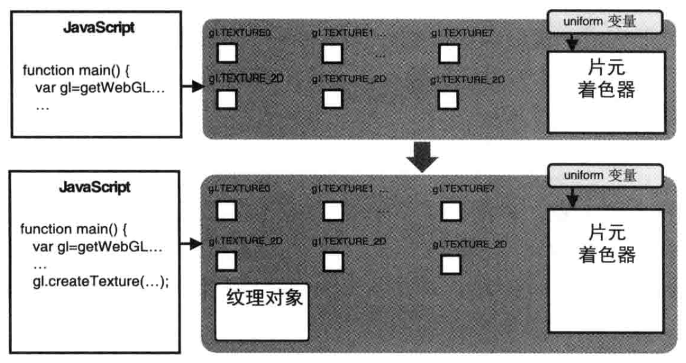

也可以使用`gl.deleteTexture()`来删除一个纹理对象。注意，如果试图删除一个已经被删除的纹理对象，不会报错也不会产生任何影响。

`gl.deleteTexture(texture)`


| 参数      | 描述       |
|---------|----------|
| texture | 待删除的纹理对象 |

| 返回值 | 描述 |
|-----|----|
| 无   |    |


| 错误 | 描述 |
|----|----|
| 无  |    |


#### 为WebGL配置纹理（loadTexture()）

该函数的主要任务是配置纹理提供的WebGL使用。使用纹理对象的方式与使用缓冲区很类似

1. **图像Y轴反转**

    在使用图像之前，必须对它进行Y轴反转
    `gl.pixelStorei(gl.UNPACK_FLIP_Y_WEBGL, 1)`
    
    WebGL纹理坐标系统中的t轴的方向和PNG、BNP、JPG等格式图片的坐标系统的Y轴方向是相反的。因此，只有先将图像Y轴进行反转，才能够正确地将图像映射到图形上。
    
    `gl.pixelStorei(pname, param)`
    
    | 参数                                | 描述                           |
    |-----------------------------------|------------------------------|
    | pname                             | 可以是以下二者之一                    |
    | gl.UNPACK_FLIP_Y_WEBGL            | 对图像进行Y轴反转。默认值为false          |
    | gl.UNPACK_PREMULTIPLY_ALPHA_WEBGL | 将图像RGB颜色值的每一个分量乘以A。默认值为false |
    | param                             | 指定非0（true）或0（false）。必须为整数    |
    
    | 返回值 | 描述 |
    |-----|----|
    | 无   |    |
    
    | 错误           | 描述          |
    |--------------|-------------|
    | INVALID_ENUM | pname不是合法的值 |
2. **激活纹理单位（gl.activeTexture()）**

    WebGL通过一种称作**纹理单位（texture unit）** 的机制来同时使用多个纹理。每个纹理单元有一个单元编号来管理一张纹理图像。
    系统支持的纹理单元个数取决与硬件和浏览器的WebGL实现，但是默认情况下，WebGL至少支持8个纹理单元，一些其他的系统支持的个数更多。内置的变量gl.TEXTRUE0、gl.TEXTURE1...gl.TEXTRUE7个表示一个纹理单元。
    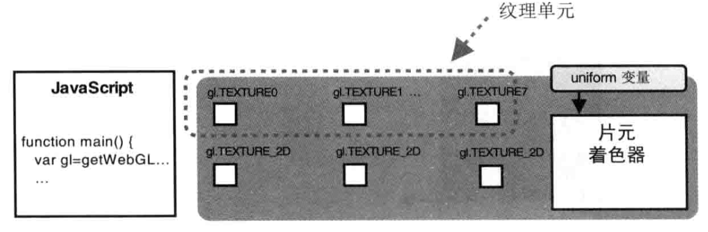
    
    在使用纹理单元之前，还需要调用`gl.activeTexture()`来激活它
    `gl.activeTexture(texUnit)` 开启0号纹理单元
    
    | 参数      | 描述                                                               |
    |---------|------------------------------------------------------------------|
    | texUnit | 指定准备激活的纹理单元：gl.TEXTURE0、gl.TEXTURE1...gl.TEXTURE7。最后的数字表示纹理单元的编号 |

    | 返回值 | 描述 |
    |-----|----|
    | 无   |    |

    | 错误           | 描述           |
    |--------------|--------------|
    | INVALID_ENUM | texUnit的值不合法 |

    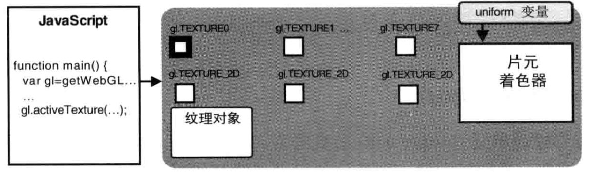
3. **绑定纹理对象（gl.bindTexture()）**

    接下来，还需要告诉WebGL系统纹理对象使用的是哪种类型的纹理。在对纹理对象进行操作之前，我们需要绑定纹理对象，这一点与缓冲区很像：在对缓冲区对象进行操作之前，也需要绑定缓冲区对象。WebGL支持两种类型的纹理
    
    | 纹理类型                | 描述    |
    |---------------------|-------|
    | gl.TEXTURE_2D       | 二维纹理  |
    | gl.TEXTURE_CUBE_MAP | 立方体纹理 |

    `gl.bindTexture(target, texture)`
    
    | 参数      | 描述                                  |
    |---------|-------------------------------------|
    | target  | gl.TEXTURE_2D 或 gl.TEXTURE_CUBE_MAP |
    | texture | 表示绑定的纹理单元                           |
    
    | 返回值 | 描述 |
    |-----|----|
    | 无   |    |

    | 错误           | 描述           |
    |--------------|--------------|
    | INVALID_ENUM | target不是合法的值 |

    此方法完成了两个任务：开启纹理对象，以及纹理对象绑定到纹理单元上。
    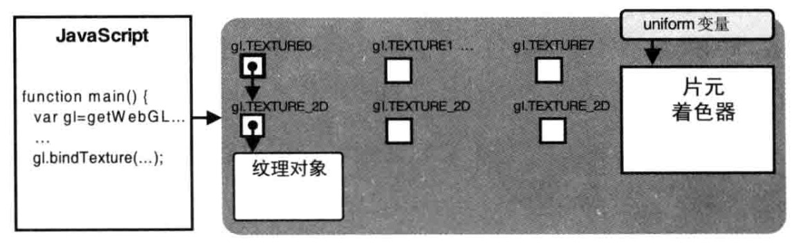

