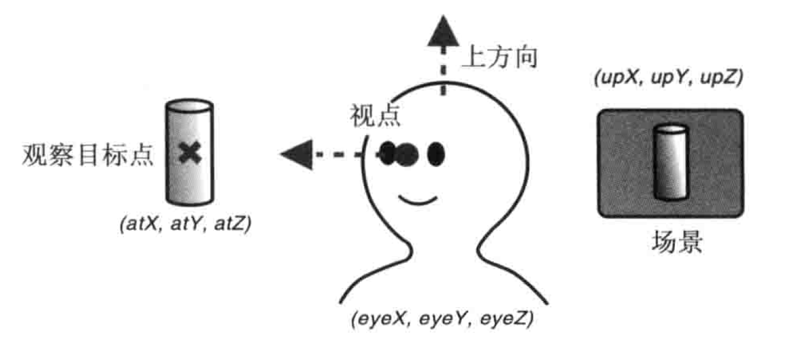
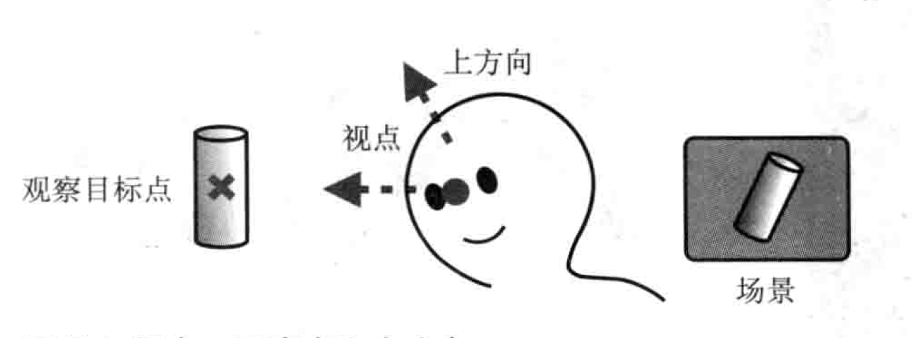
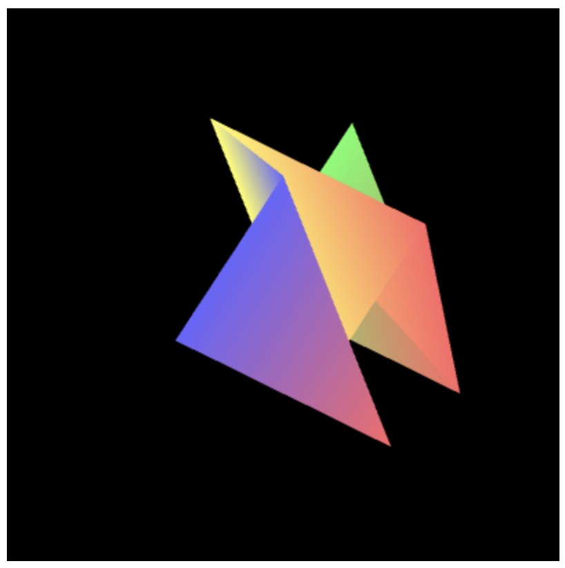

# 进入三维世界

- 以用户视角而进入三维世界
- 控制三维可视空间
- 裁剪
- 处理物体的前后关系
- 绘制三维的立方体

## 视点和视线

- 观察方向，即观察者自己在什么位置，在看场景的哪一部分
- 可视距离，即观察者能够看多远

将观察者所处的位置称为**视点**，从视点出发沿着观察方向的射线称作**视线**。

## 视点、观察目标点和上方向

为了确定观察者的状态，需要获取两项信息：**视点**，即观察者的位置；**观察目标点**，即被观察目标所在的点，它可以用来确定视线。
因为需要把观察到的景象绘制到屏幕上，还需要知道**上方向**。



- 视点：观察者所在的三维空间中位置，视线的起点。
- 观察目标点：被观察目标所在的点。视线从视点出发，穿过观察目标点并继续延申。注意，观察目标点是一个点，而不是视线方向，只有同时知道观察目标点和视点，才能算出视线方向。
- 上方向：最终绘制在屏幕上的影像中的向上的方向。试想，如果仅仅确定了视点和观察点，观察者还是可能以视线为轴旋转的（如图，头部偏移会导致观察到的场景也偏移了）。所以，为了将观察者固定住，还需要指定上方向。上方向是具有3个分量的矢量。



在WebGL中，我们可以用上述三个矢量创建一个**视图矩阵**，然后将该矩阵传给顶点着色器。视图矩阵可以表示观察者的状态，含有观察者的视点、观察目标点、上方向等信息。之所以被称为视图矩阵，是因为它最终影响了显示在屏幕上的视图，也就是观察者观察到的场景。

**Matrix4.setLookAt(eyeX，eyeY，eyeZ，atX，atY，atZ，upX，upY，upZ)**

| 参数             | 描述                                         |
|----------------|--------------------------------------------|
| eyeX，eyeY，eyeZ | 指定视点                                       |
| atX，atY，atZ    | 指定观察点                                      |
| upX，upY，upZ    | 指定上方向，如果上方向是Y轴正方向，那么（upX，upY，upZ）就是（0，1，0） |

在WebGL中，观察者的默认状态应该是这样的：

- 视点位于坐标系统原点（0，0，0）
- 视线为Z轴负方向，观察点为（0，0，-1），上方向为Y轴正方向，即（0，1，0）

```glsl
var initialViewMatrix = new Matrix4()

initialViewMatrix.setLookAt(0,0,0,0,0,-1,0,1,0)
```

LookAtTriangle.js

```js
const VSHADER_SOURCE =
    'attribute vec4 a_Position;\n' +
    'attribute vec4 a_Color;\n' +
    'uniform mat4 u_ViewMatrix;\n' +
    'varying vec4 v_Color;\n' +
    'void main(){\n' +
    'gl_Position = u_ViewMatrix * a_Position;\n' +
    'v_Color = a_Color;\n' +
    '}\n'

const FSHADER_SOURCE =
    '#ifdef GL_ES\n'+
    'precision mediump float;\n' +
    '#endif\n' +
    'varying vec4 v_Color;\n' +
    'void main(){\n' +
    'gl_FragColor = v_Color;\n' +
    '}\n'


function main() {
    const canvas = document.querySelector('canvas');
    const gl = canvas.getContext('webgl');
    if(!gl){
        console.error('Unable to initialize WebGL!');
        return;
    }

    if(!initShaders(gl, VSHADER_SOURCE, FSHADER_SOURCE)) {
        console.error('Failed to initialize shaders.')
    }


    const n = initVertexBuffers(gl);

    if (n < 0) {
        console.error('Failed to initialize shaders.')
    }
    
    // 获取 u_ViewMatrix 变量
    const u_ViewMatrix = gl.getUniformLocation(gl.program, 'u_ViewMatrix')
    // 设置视点 视线 上方向
    const viewMatrix = new Matrix4()
    viewMatrix.setLookAt(0.20, 0.25,0.25, 0,0,0,0,1,0)


    // 将视图矩阵 传给u_ViewMatrix 变量
    gl.uniformMatrix4fv(u_ViewMatrix,false, viewMatrix.elements)
    
    gl.clearColor(0.0, 0.0, 0.0, 1.0)

    gl.clear(gl.COLOR_BUFFER_BIT)
    gl.drawArrays(gl.TRIANGLE_STRIP, 0, n)
}

function initVertexBuffers(gl) {
    const verticesColors = new Float32Array([
        0.0, 0.5, -0.4, 0.4, 1.0, 0.4,
        -0.5, -0.5, -0.4, 0.4, 1.0, 0.4,
        0.5, -0.5, -0.4, 1.0, 0.4, 0.4,

        0.5, 0.4, -0.2, 1.0, 0.4, 0.4,
        -0.5, 0.4, -0.2, 1.0, 1.0, 0.4,
        0.0, -0.6, -0.2, 1.0, 1.0, 0.4,

        0.0, 0.5, 0.0, 0.4, 0.4, 1.0,
        -0.5, -0.5, 0.0, 0.4, 0.4, 1.0,
        0.5, -0.5, 0.0, 1.0, 0.4, 0.4
    ])
    const n = 9;
    
    // 创建缓冲区对象
    const vertexColorbuffer = gl.createBuffer();
    // 绑定缓冲区对象
    gl.bindBuffer(gl.ARRAY_BUFFER, vertexColorbuffer)
    // 给缓冲区对象绑定数据
    gl.bufferData(gl.ARRAY_BUFFER, verticesColors, gl.STATIC_DRAW);
    
    // 获取类型化数组中的每个元素所占用的字节数
    const size = verticesColors.BYTES_PER_ELEMENT
    
    // 获取 a_Position 变量
    const a_Position = gl.getAttribLocation(gl.program, 'a_Position')
    // 将缓冲区对象分配给变量
    gl.vertexAttribPointer(a_Position, 3, gl.FLOAT, false, size * 6, 0);
    // 开启变量 方便顶点着色器访问缓冲区内的数据
    gl.enableVertexAttribArray(a_Position)

    // 获取变量
    const a_Color = gl.getAttribLocation(gl.program, 'a_Color');
    // 将缓冲区对象分配给变量
    gl.vertexAttribPointer(a_Color, 3, gl.FLOAT, false, size * 6, size * 3);
    // 开启变量
    gl.enableVertexAttribArray(a_Color);
    // 返回 点数
    return n

}
```



**注意：**
上面绘制的图形为`gl.drawArrays(gl.TRIANGLE_STRIP, 0, n)`

下面绘制的图形为`gl.drawArrays(gl.TRIANGLES, 0, n)`


## 从指定视点观察旋转后的三角形

需要两个矩阵，一个是旋转矩阵，一个是视图矩阵。

矩阵乘以顶点坐标，得到的结果是顶点经过矩阵变换后的新坐标。用旋转矩阵乘以顶点坐标，得到旋转后的顶点坐标。

要想要图形旋转，就需要旋转矩阵乘以旋转前的顶点坐标。

<旋转后的顶点坐标> = <旋转矩阵> * <原始顶点坐标>

<从视点看上去 的旋转顶点坐标> = <视图矩阵> * <旋转矩阵> * <原始顶点坐标>
